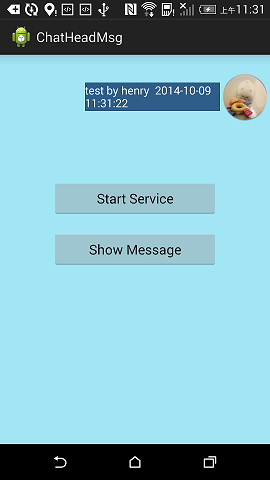
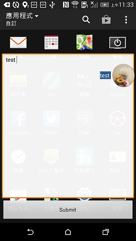

Android-ChatHead
===========

ChatHead for Android app, like FB messenger.

<br/><br/>

How to Use
-----------
Start ChatHead :
```Java
startService(new Intent(Main.this, ChatHeadService.class));
```
<br/>
Show Message(see below pic 'Messager') :
```Java
Intent it = new Intent(Main.this, ChatHeadService.class);
it.putExtra(Utility.EXTRA_MSG, str);
startService(it);
```
<br/>
Stop ChatHead(see below pic 'LongPressing to Stop') :<br/>
long click and move chathead to the round on bottom


ScreenShot
-----------
**Dragging and Bounce animation**<br/>


<br/><br/>
**Messenger**<br/>

<br/>


<br/><br/>
**LongPressing to Stop**<br/>


<br/><br/>
**landscape screenOrientation**<br/>


Update
-----------
**Support landscape screenOrientation** (2015-4-23)<br/>
when screenOrientation change to portrait or landscape, ChatHead will reposition automatically.
<br/>
**IDE convert** (2015-7-28)<br/>
from Eclipse to Android Studio.
<br/>
**Problem Solved** (2015-8-11)<br/>
crash when close app from task manager
<br/>
**Runtime Permission** (2016-1-19)<br/>
support Android 6.0 runtime permissions

